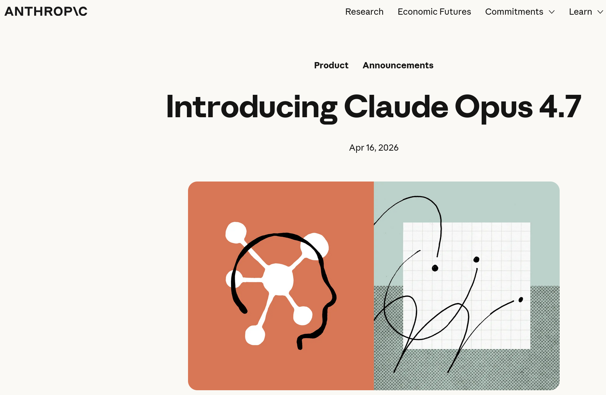

# Anthropic Introduced Claude Opus 4.7

Anthropic Announcement

**16 Apr 2026**

Opus 4.7 is a notable improvement on Opus 4.6 in advanced software engineering, with particular gains on the most difficult tasks. Users report being able to hand off their hardest coding work—the kind that previously needed close supervision—to Opus 4.7 with confidence. Opus 4.7 handles complex, long-running tasks with rigor and consistency, pays precise attention to instructions, and devises ways to verify its own outputs before reporting back.


## Reference
+ Anthropic, "Introducing Claude Opus 4.7", [16 Apr 2026](https://www.anthropic.com/news/claude-opus-4-7)


```
#Anthropic
#Opus
#LLM
#Claude
```


