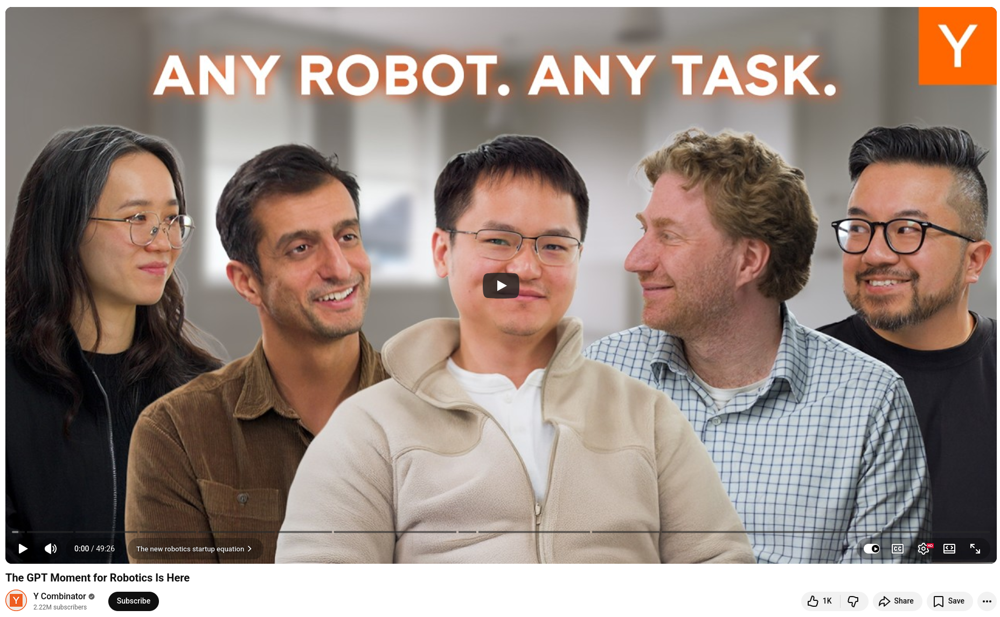

# The GPT Moment for Robotics Is Here


Y Combinator, 16 Apr 2026
=========================

The company **Physical Intelligence (π)** is developing a foundation model that can control any robot to perform any task. The team describes this as the GPT-1 moment for robotics. The company's cross-embodiment approach involves training across many different robot platforms. Recent results demonstrate that tasks which last year required hundreds of hours of data collection can now be performed with zero-shot learning.


## References
+ 🔗 Physical Intelligence (π), [20 Apr 2026](https://www.pi.website/)
+ 🎥 Y Combinator, "The GPT Moment for Robotics Is Here", [16 Apr 2026](https://www.youtube.com/watch?v=4EsUaur0nsQ)


```
#Robotics
#AI
#PhysicalIntelligence
#GenerativeAI
#AIRobotics 
```


