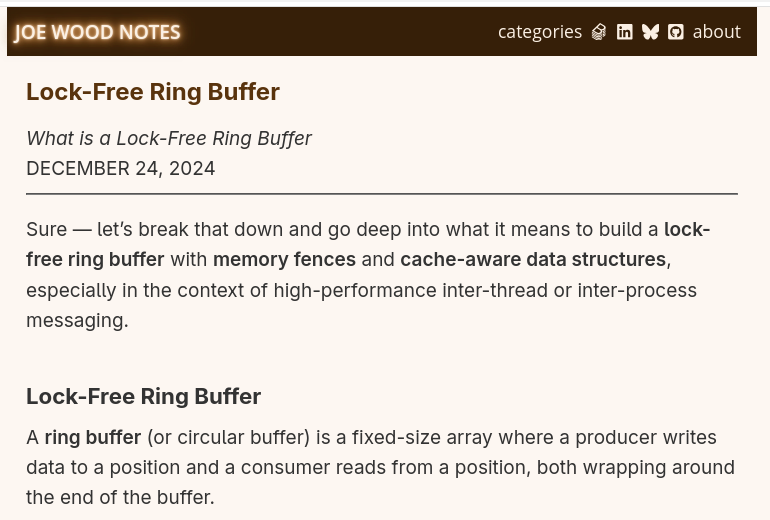

# Every nanosecond counts. Lock-Free Ring Buffer by Joe Wood

Joe Wood's recent article, "Lock-Free Ring Buffer," is one of the clearest explanations I've seen of a data structure at the core of low-latency systems in production trading infrastructure. Here's why it matters to every C++ engineer working in HFT or systems programming:

## WHY RING BUFFERS IN HFT?

Market data arrives in microsecond bursts. You need a structure that allows a producer (e.g., your market feed handler) to write ticks, and a consumer (e.g., your strategy engine) to read them — with zero blocking, zero heap allocation, and zero contention. A ring buffer is that structure.

## WHY LOCK-FREE?

A mutex on the critical path creates latency. Lock-free coordination via `std::atomic` and carefully chosen memory orderings (acquire/release semantics) eliminates OS-level scheduling overhead entirely. Wood's article illustrates exactly where to place memory fences: on write before updating the head index and on read after loading it. This ensures correctness without sacrificing throughput.

## CACHE-AWARENESS IS NON-NEGOTIABLE

One of the most underappreciated topics Wood covers is false sharing. When the head and tail indexes share a cache line, each write by the producer invalidates the consumer's cache, which is a silent performance killer. The solution is to use `alignas(64)` padding to isolate hot variables on their own cache lines. This is not a micro-optimization in HFT; it's essential.

## SEQUENCE NUMBERS > MODULO ARITHMETIC

Wood explains the evolution from naive `(head + 1) % size` wraparound logic to monotonically increasing sequence counters, which is the same pattern used by LMAX Disruptor and Aeron. This approach eliminates ambiguity regarding fullness or emptiness, supports multiple producers and consumers, and naturally maps to slot-level state tracking via per-slot atomic sequence fields.

## THE DISRUPTOR PATTERN IN PRODUCTION

For those developing trading pipelines, the article's discussion of per-slot sequence numbers is essential for grasping the Disruptor pattern, which is the foundation of some of the fastest order-processing systems ever deployed. If you use a mutex-guarded `std::queue` in your order pipeline, this article will prompt you to rethink your approach.

## Key takeaways from the article:
+ No dynamic allocation during operation — preallocate everything
+ Use release fences on write, acquire fences on read
+ Pad atomic indexes to 64-byte cache lines to prevent false sharing
+ Prefer sequence numbers over modulo logic for multi-producer scenarios
+ Per-slot atomic sequence fields are the lock-free coordination mechanism of choice in production-grade systems


## References
+ Joe Wood, "Lock-Free Ring Buffer", [14 April 2026](https://www.joewood.me/posts/lock-free-ring-buffer)

```
#HighFrequencyTrading
#LowLatency
#Cpp
#AlgorithmicTrading
#ConcurrentProgramming
```


