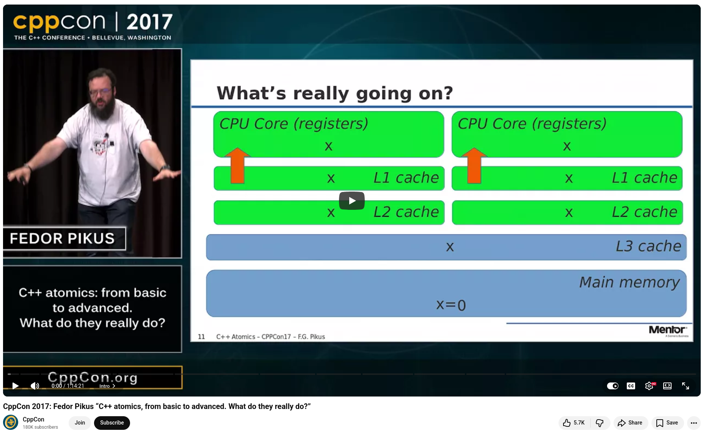

# C++ atomics, from basic to advanced by Fedor G Pikus


Check out Fedor G. Pikus's CppCon 2017 talk, "C++ Atomics: From Basic to Advanced. What Do They Really Do?".


## Algorithm comes first

Pikus begins with an unexpected benchmark: a wait-free program that uses `std::atomic` increment runs more slowly and is less scalable than a program that uses a mutex and a local accumulator with a single lock at commit time. Atomic operations do not guarantee performance. 


## Atomic expressions are not always atomic

`x++`, `x += 1`, and `x = x + 1` are equivalent for a plain `int`, but not for a `std::atomic<int>`. The first two compile to a single atomic read-modify-write. The third compiles into separate atomic reads and writes with an intervening window where another thread can intervene. The compiler will not warn you.


## Not all atomics are lock-free

Just because a type is wrapped in `std::atomic` doesn't mean the hardware treats it as lock-free. Struct size, padding, and alignment all matter. Use the `is_lock_free()` function at runtime, or the `is_always_lock_free()` function in `C++17`, to verify this before relying on it.


## Memory barriers are the other half of the story

Atomics and memory barriers are two sides of the same coin. When publishing a node through an atomic pointer, the non-atomic memory that the node points to must be correctly visible to other threads. Memory ordering — `relaxed`, `acquire`, `release`, and `seq_cst` — expresses that relationship. However, defaulting to `seq_cst`, which is what a raw assignment on an atomic gives you, can cost roughly 15 times more in performance than a correctly chosen relaxed or acquire/release order.


## Be explicit. Say exactly what you mean

Every memory order is a statement of intent, both to the hardware and to your colleagues. The `memory_order_release` tells the reader: "I'm publishing memory prepared before this point." Writing `seq_cst` when it's not necessary means you're either overpaying or communicating the wrong thing.


## False sharing is a silent performance killer

Two atomic variables within the same 64-byte cache line behave as if they were one variable when there is contention, even if they are logically independent. Align them on separate cache lines when write contention is high.


💡 Lock-free programming is worth it when it solves problems that locks can't, such as composability, latency sensitivity, and priority inversion. However, it must be earned. Know your hardware, measure everything, and write precisely what you intend.


## References

+ 🎥 Fedor G Pikus, "C++ atomics, from basic to advanced. What do they really do?", CppCon 2017, [10 Oct 2017](https://www.youtube.com/watch?v=ZQFzMfHIxng)


```
#CPlusPlus
#ConcurrentProgramming
#LockFreeProgramming
#SystemsProgramming
#CppCon
```


