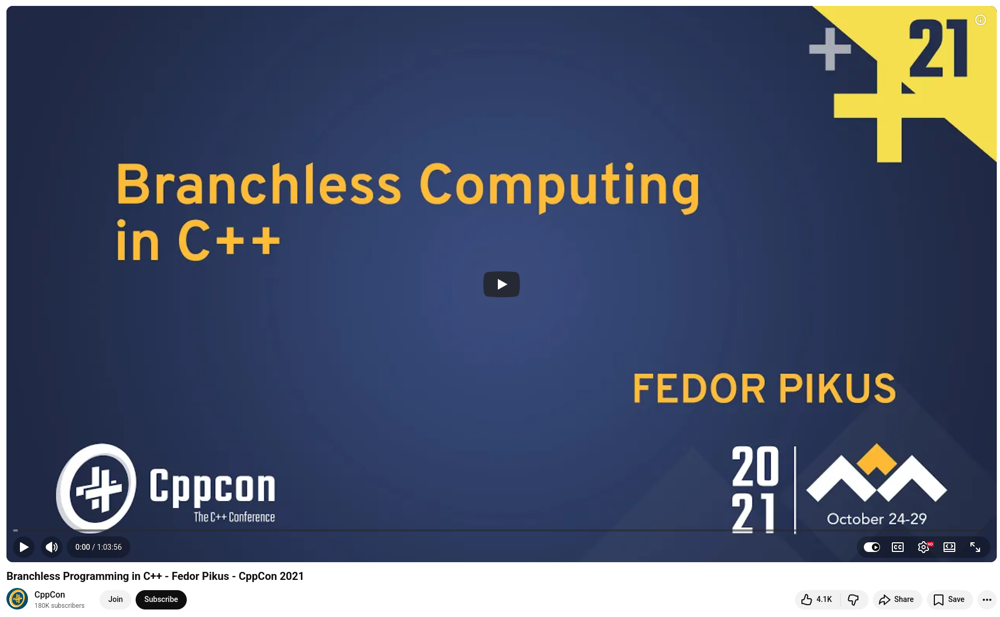

# Branchless Programming in C++ by Fedor G Pikus

At CppCon 2021, Fedor G. Pikus gave one of the most eye-opening presentations I've seen: "Branchless Programming in C++." The benchmark results alone are worth watching.

The core insight: Modern CPUs are extremely powerful, yet this power is often wasted due to conditional branches that disrupt the instruction pipeline.


## Here's the mental model that Pikus developed:

+ **CPUs are built for parallelism.** Through pipelining, processors can execute multiple independent instruction streams simultaneously, which keeps the compute units busy instead of leaving them idle.

+ **Branches disrupt the flow.** When the CPU encounters a conditional instruction, it doesn't know which instruction comes next. To compensate, the CPU speculates by guessing the outcome and pre-executing the expected path.

+ **Wrong guesses can be catastrophic.** When a branch is mispredicted, the CPU must flush its pipeline, discard speculative results, and reload the correct instructions. Pikus demonstrated this with a striking benchmark: a randomly evaluated branch ran at just one-sixth the speed of a well-predicted one—a sixfold performance penalty from a single unpredictable condition.


## So what can we do about it?

+ **Replace short-circuit logic with bitwise operations**, as `if (x || y)` forces two sequential branch evaluations. Using `if (x + y)` or `if (x | y)`, however, collapses them into one predictable check. Pikus demonstrated that this recovers most of the lost performance.

+ **Use Boolean indexing to eliminate branches entirely.** Rather than branching on a condition to select between two values, compute both values and index into an array. The result is `arr[condition]`. In misprediction-heavy scenarios, this approach achieved a speedup of about 4x.

+ **Always profile first.** This is non-negotiable. Pikus was emphatic that misguided optimization is expensive, too. Use `perf stat` or similar tools to confirm branch misprediction rates before modifying your code. A well-predicted branch is essentially free; you cannot optimize your way past it.


💡 Branchless optimizations are invasive and involve real trade-offs. Typically, more work is required to avoid branches. These optimizations only pay off when mispredictions are confirmed and the eliminated expressions are lightweight. The process is: profile, optimize, then profile again.


## References
+ 🎥 Fedor G Pikus, "Branchless Programming in C++", CppCon 2021, [5 Jan 2022](https://www.youtube.com/watch?v=g-WPhYREFjk)


```
#CPlusPlus
#CppCon
#PerformanceEngineering
#SystemsProgramming
#SoftwareOptimization
```


