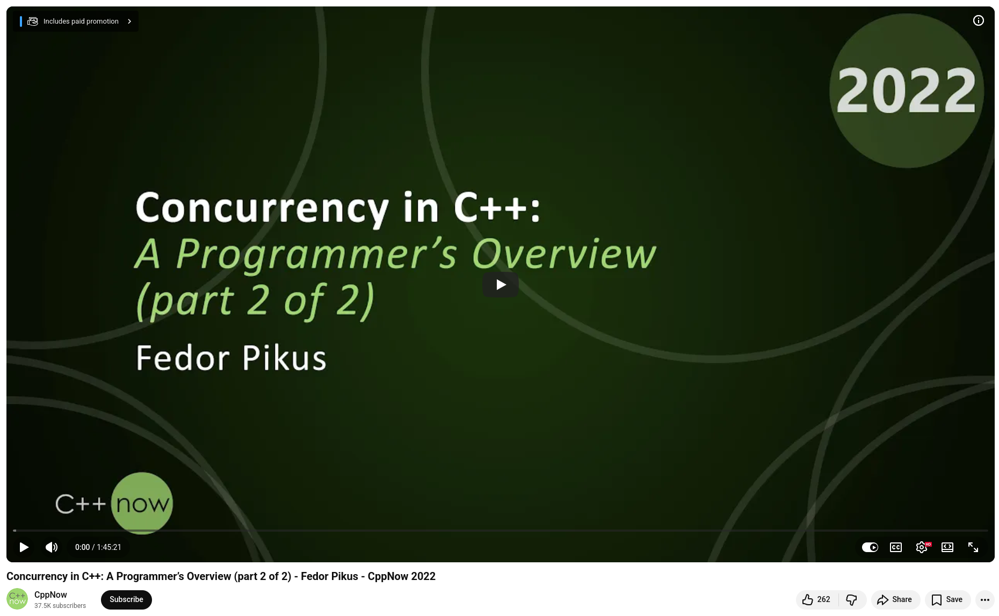

# Concurrency in C++ by Fedor G Pikus

At CppCon 2022, Fedor G. Pikus delivered one of the most comprehensive overviews of C++ concurrency that I have seen: "Concurrency in C++: A Programmer's Overview."


## Before C++11, we were flying blind
Pre-C++11 code relied on POSIX or Win32 conventions, rather than the language itself. Because the compiler had no concept of threads, it was free to hoist operations out of "locked" regions. What saved us? Compilers that voluntarily obeyed external standards. You don't want to build on that foundation.


## The real gift of C++11 wasn't just `std::thread` — it was the memory model
C++11 formally defined how threads interact with memory. It ensures that accessing different memory locations from various threads is always safe. It also clarifies exactly when undefined behavior occurs (i.e., concurrent reads and writes to the same location). This provided us with a shared vocabulary to reason about concurrency, which is as important as the primitives themselves.


## Threads are expensive. Use them wisely
Pikus measured thread startup latency at ~0.1 ms and join latency at ~0.2 ms. That equates to hundreds of thousands of potential CPU instructions. Short computations don't belong in dedicated threads. The correct approach is to maintain a small, long-lived thread pool and feed it tasks instead of creating threads for each computation.


## `std::async` is not your friend for performance
In practice, implementations either serialize work or spawn an unlimited number of threads. Until the standard incorporates executors, use a proven library (TBB, etc.) for real workloads.


## C++20 filled meaningful gaps:
+ `std::latch` and `std::barrier` for thread synchronization points
+ `std::semaphore` for resource counting
+ `std::jthread` for automatic joining
+ Coroutines for async programming


## `thread_local` is an underused gem
With per-thread storage, you can eliminate locks entirely on hot paths. Simply aggregate the results at the end.

💡 The deeper message of this talk is that the C++ memory model is more than just plumbing. Rather, it's a contract between you, the compiler, and the hardware. Understanding this contract can transform your concurrent code from "seems to work" to "provably correct."


## References
+ 🎥 Fedor G Pikus, "Concurrency in C++: A Programmer’s Overview (part 1)", CppNow 2022, [22 Jul 2022](https://www.youtube.com/watch?v=ywJ4cq67-uc)
+ 🎥 Fedor G Pikus, "Concurrency in C++: A Programmer’s Overview (part 2)", CppNow 2022, [22 Jul 2022](https://www.youtube.com/watch?v=R0V4xJ9HZpA)


```
#CPlusPlus
#CppCon
#Concurrency
#SystemsProgramming
#SoftwareOptimization
```



