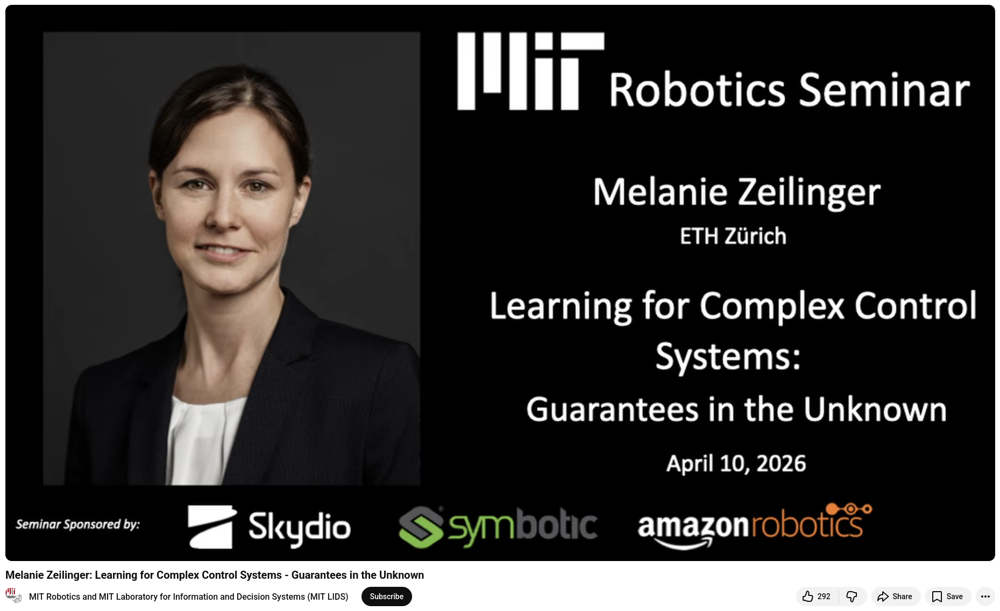

# Learning for Complex Control Systems - Guarantees in the Unknown

**Lab**: MIT Robotics and MIT Laboratory for Information and Decision Systems (MIT LIDS)

**Date**: 10 April 2026

**Speaker**: Melanie Zeilinger

**Seminar title**:  Learning for Complex Control Systems: Guarantees in the Unknown

**Affiliation**: ETH Zürich


## References
+ 🎥 Melanie Zeilinger, "Learning for Complex Control Systems - Guarantees in the Unknown", 17 Apr 2026, https://www.youtube.com/watch?v=tfDv32K5Pmo


```
#Robotics
#AI
#PhysicalIntelligence
#GenerativeAI
#AIRobotics 
```


