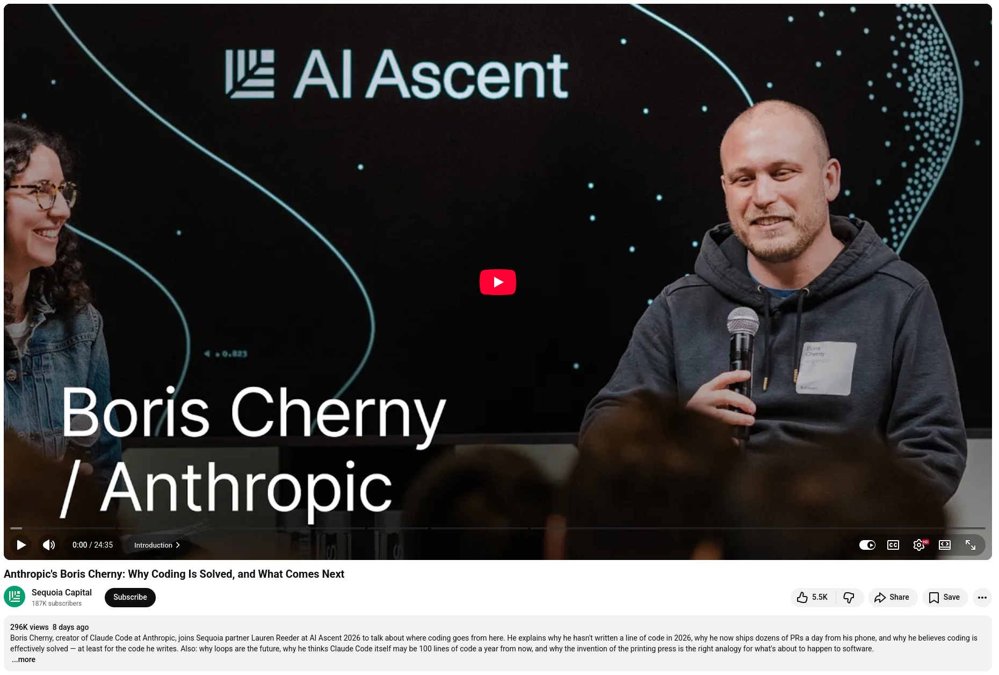

## Anthropic's Boris Cherny: Why Coding Is Solved, and What Comes Next

Boris Cherny, creator of Claude Code at Anthropic, joins Sequoia partner Lauren Reeder at AI Ascent 2026 to talk about where coding goes from here. He explains why he hasn't written a line of code in 2026, why he now ships dozens of PRs a day from his phone, and why he believes coding is effectively solved — at least for the code he writes. Also: why loops are the future, why he thinks Claude Code itself may be 100 lines of code a year from now, and why the invention of the printing press is the right analogy for what's about to happen to software.


**Date: 4 May 2026**


## References
+ 🔗 Claude Code, [13 May 2026](https://claude.com/product/claude-code)
+ 🎥 Anthropic's Boris Cherny: Why Coding Is Solved, and What Comes Next, [4 May 2026](https://www.youtube.com/watch?v=SlGRN8jh2RI)


```
#Anthropic
#ClaudeCode
#LLM
#Claude
```


