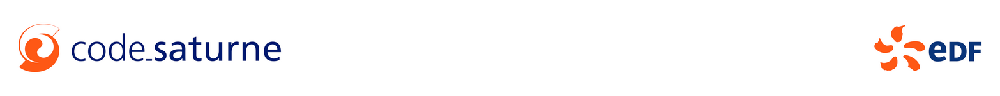

# code_saturne: software for computational fluid dynamics (CFD) applications

code_saturne is the free, open-source software developed primarily by EDF for computational fluid dynamics (CFD) applications.

It solves the Navier-Stokes equations with scalar transport for 2D, 2D-axisymmetric, and 3D flows, whether steady or unsteady, laminar or turbulent, incompressible, dilatable, or weakly compressible, isothermal or not.

**It is based on a finite-volume** approach that accepts unstructured meshes with any type of cell (tetrahedral, hexahedral, prismatic, pyramidal, polyhedral...). Most models use co-located cell-centered finite volumes, with work in progress on CDO (compatible discrete operator) numerical schemes.

The code_saturne solver can run on just about any UNIX or Linux type system and processor (including of course x86_64 and various ARM type processors).

**Several turbulence models are available**, from Reynolds-Averaged models to Large-Eddy Simulation models. In addition, a number of specific physical models are also available as modules: gas, coal combustion, semi-transparent radiative transfer, particle-tracking with Lagrangian modeling, Joule effect, electrics arcs, weakly compressible flows, atmospheric flows, rotor/stator interaction for hydraulic machines.

## References
+ 🔗 code_saturne [home page](https://www.code-saturne.org/cms/web/)
+ 🔗 Source code repository on [GitHub](https://github.com/code-saturne/code_saturne)

