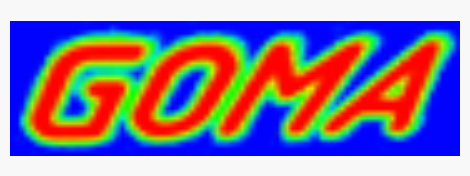

# Goma: open-source, scalable, parallel multiphysics software


**Goma** is an open-source, scalable, parallel multiphysics software package used for modeling and simulating physical processes. It can solve problems in all branches of mechanics, including fluid mechanics, solid mechanics, and thermal analysis. Goma uses advanced numerical methods to solve problems involving coupled phenomena for manufacturing and performance applications. It also provides a flexible software development environment for specialty physics. It is used to reduce process development time, understand fundamental processes, and educate the next generation of computational scientists.


**Goma** has been applied to the design of manufacturing processes and the performance of devices within national laboratories and industry. Its applications range from coating and drying to polymer processing and joining. Specific examples include processing flat-panel glass at Corning, using 3M® aluminum conductor composite materials to reinforce power lines, and applying porous adsorbent media at Procter & Gamble.


## References:

+ 🔗 Goma [Home page](https://www.gomafem.com/)


```
#MultiphysicsSimulation
#ComputationalEngineering
#OpenSourceCAE
#NumericalMethods
#ScientificComputing
```



