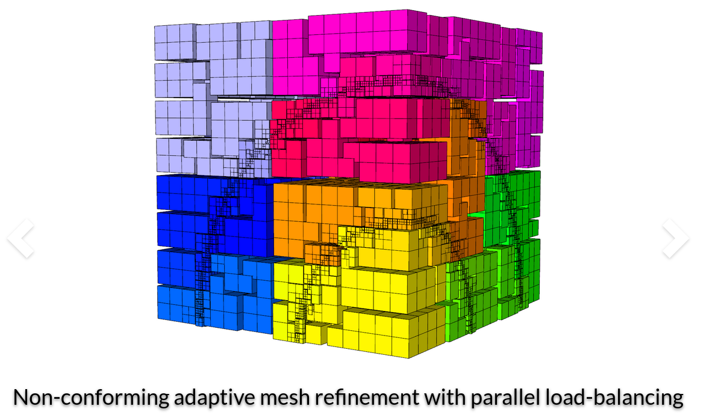

# MFEM: free, lightweight, scalable C++ FEM library


The goal of MFEM is to enable scalable, **high-performance finite element discretization** research and application development on various platforms, ranging from laptops to supercomputers.


**MFEM** is a finite element toolbox that provides the building blocks for developing finite element algorithms.


**MFEM** supports MPI-based parallelism throughout the library and can be used easily as a scalable, unstructured finite element problem generator.


**MFEM** is often used as a "finite element to linear algebra translator" because it can convert finite element problems into their corresponding linear algebra vectors and sparse matrices.


## References:

+ 🔗 MFEM [home page](https://mfem.org/)


```
#FEM
#ScientificComputing
#Cplusplus
#HPC
#NumericalMethods
```



