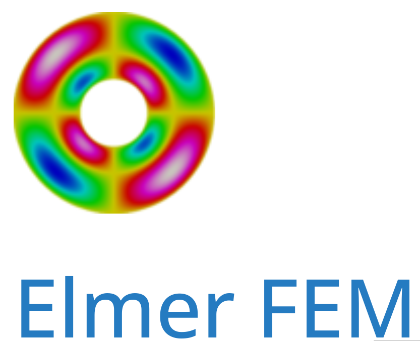

# Elmer FEM: open source multiphysical simulation software 


**Elmer** is open-source finite element software for multiphysics problems. It includes physical models of fluid dynamics, structural mechanics, electromagnetics, heat transfer, acoustics, and more. Elmer supports parallel computing. Good scalability up to thousands of cores has been demonstrated for many problems.

**Elmer** is primarily developed by CSC – IT Center for Science, though not exclusively. This site's purpose is to provide services that benefit the user community.

**Elmer**'s development continues actively, primarily through numerous R&D projects that expand its applications in various fields. The most notable areas are computational glaciology and computational electromagnetics. Elmer has a large international community and is being developed in several ongoing EU projects, including those related to ice, known as Elmer/Ice. In the field of electromagnetics, the Elmer team is part of the Center of Excellence in High-Speed Electromechanical Energy Conversion Systems (HiECSs). 


## References:

+ 🔗 Elmer FEM [home page](https://www.elmerfem.org)


```
#FEM
#ScientificComputing
#Elmer
#HPC
#NumericalMethods
```



