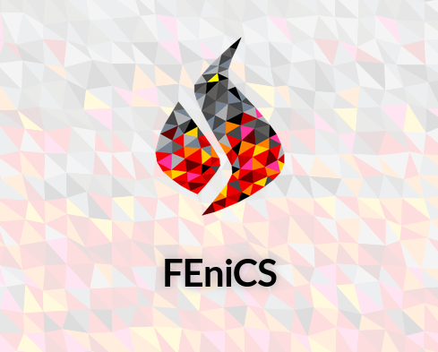

# FEniCS: open source computing platform

**FEniCS** is a popular, open-source computing platform that uses the finite element method (FEM) to solve partial differential equations (PDEs). FEniCS allows users to swiftly convert scientific models into effective finite element code. FEniCS offers high-level Python and C++ interfaces that make it easy to get started, but it also provides powerful capabilities for more experienced programmers. FEniCS runs on a variety of platforms, from laptops to high-performance computers.

The book **Automated Solution of Differential Equations by the Finite Element Method** provides a thorough explanation of the theoretical background and design of FEniCS. It describes the software's components in detail and showcases its applications to problems in fluid mechanics, solid mechanics, electromagnetics, and geophysics. Published in 2012, the book is based on the legacy FEniCS library, so the code examples are outdated. Nevertheless, the book provides a comprehensive overview of FEniCS concepts.


## References:

+ 🔗 FEniCS [home page](https://fenicsproject.org/)


```
#FEniCS
#FiniteElementMethod
#ScientificComputing
#OpenSource
#PDESolvers
```



