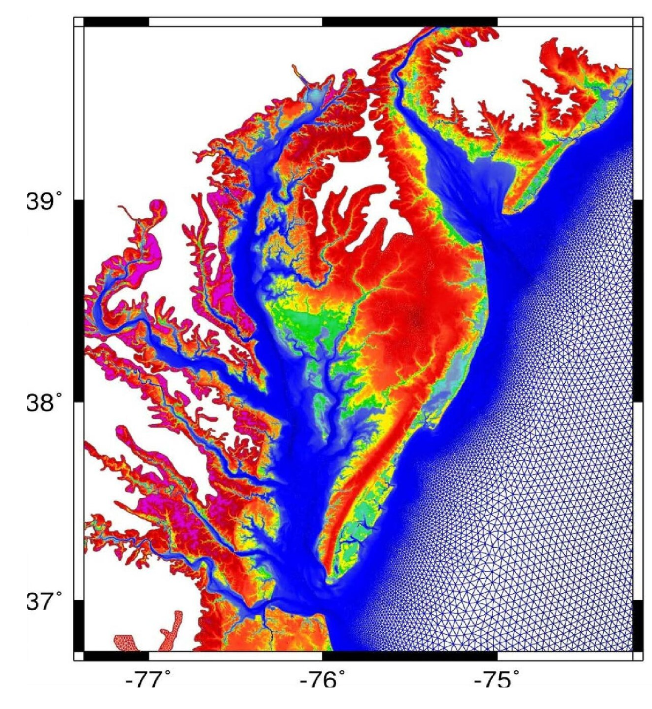

# ADCIRS: Open-Source, simulation of moving fluid on a rotating Earth

**ADCIRC** is a sophisticated computer program that solves the equations of motion for a moving fluid on a rotating Earth. These equations are based on traditional hydrostatic pressure and Boussinesq approximations. The equations are discretized in space using the finite element method and in time using the finite difference method.

**ADCIRC** can be run as either a two-dimensional, depth-integrated (2DDI) model or a three-dimensional (3D) model. In both cases, elevation is obtained by solving the generalized wave-continuity (GWCE) form of the depth-integrated continuity equation. Velocity is obtained by solving the 2DDI or 3D momentum equations. These equations retain all nonlinear terms.

**ADCIRC** can be run using either a Cartesian or a spherical coordinate system.


## References:

+ 🔗 ADCIRC [home page](https://adcirc.org/)


```
#ADCIRC
#RotatingEarth
#ScientificComputing
#CFD
#MovingFluid
```



