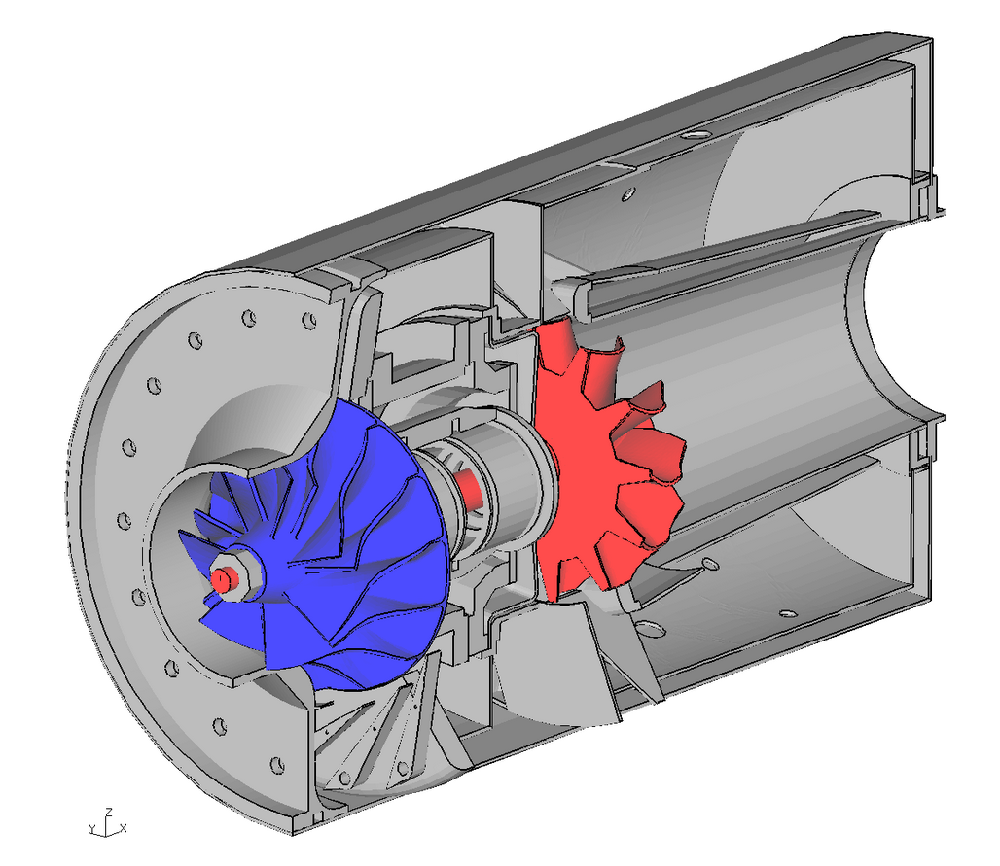

# CALCULIX: A Free Software Three-Dimensional Structural Finite Element Program

**CalculiX** is a software package designed for solving field problems. It uses the finite element method.

With **CalculiX**, users can build, calculate, and post-process finite element models. The pre- and postprocessor is an interactive 3D tool that uses the OpenGL API. The solver can perform linear and nonlinear calculations. Static, dynamic, and thermal solutions are available. Both programs can be used independently. Since the solver uses the Abaqus input format, commercial preprocessors can also be used. The preprocessor can also write mesh-related data for Nastran, Abaqus, ANSYS, Code Aster, as well as the free CFD codes Dolfyn, DUNS, ISAAC, and OpenFOAM. A simple step reader is included. Additionally, external CAD interfaces are available. The program is designed to run on Unix platforms, such as Linux and IRIX, as well as MS Windows.


## References:

+ 🔗 CALCULIX [home page](https://www.calculix.de/)


```
#CalculiX
#FiniteElementMethod
#OpenSource
#CFD
#HPC
```



