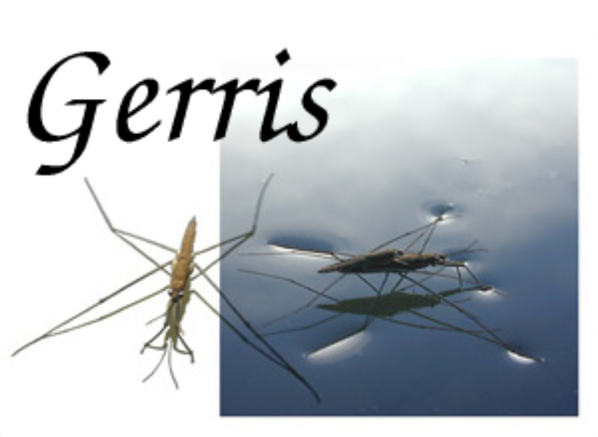

# Gerris Flow Solver; Free Software

**Gerris** is free software for solving partial differential equations that describe fluid flow. Its source code is available free of charge under the GNU GPL license.

Stéphane Popinet created **Gerris**, which is supported by the Institut Jean le Rond d'Alembert. Please note that the original Gerris developers have moved development to Basilisk, which can do most of what Gerris can do and more. 

## A brief summary of its main features:

+ Solves the time-dependent incompressible variable-density Euler, Stokes or Navier-Stokes equations
+ Solves the linear and non-linear shallow-water equations
+ Adaptive mesh refinement: the resolution is adapted dynamically to the features of the flow
+ Entirely automatic mesh generation in complex geometries
+ Second-order in space and time
+ Unlimited number of advected/diffused passive tracers
+ Flexible specification of additional source terms
+ Portable parallel support using the MPI library, dynamic load-balancing, parallel offline visualisation
+ Volume of Fluid advection scheme for interfacial flows
+ Accurate surface tension model
+ Multiphase electrohydrodynamics 


## References:

+ 🔗 Gerris [home page](https://gerris.dalembert.upmc.fr/)


```
#OpenSourceSoftware
#ComputationalFluidDynamics
#CFD
#ScientificComputing
#HighPerformanceComputing
```



