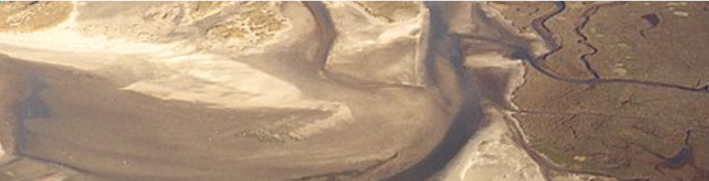

# Delft3D is open-source software that facilitates hydrodynamics

**Delft3D** is a world-leading 3D modeling suite used to study hydrodynamics, sediment transport, morphology, and water quality in fluvial, estuarine, and coastal environments. As of January 1, 2011, the Delft3D FLOW, MOR, and WAVE modules are available as open source software.

The software has been used and proven its capabilities in many places around the world, including the Netherlands, the United States, Hong Kong, Singapore, Australia, and Venice. It is continuously improved and developed with innovative, advanced modeling techniques as a result of research. 

The **FLOW module** is the heart of Delft3D and is a multi-dimensional (2D or 3D) hydrodynamic (and transport) simulation programme which calculates non-steady flow and transport phenomena resulting from tidal and meteorological forcing on a curvilinear, boundary fitted grid or spherical coordinates. In 3D simulations, the vertical grid is defined following the so-called sigma coordinate approach or Z-layer approach.


## References:

+ 🔗 Delft3D [home page](https://oss.deltares.nl/web/delft3d)


```
#OpenSourceSoftware
#ComputationalFluidDynamics
#CFD
#ScientificComputing
#HighPerformanceComputing
```


